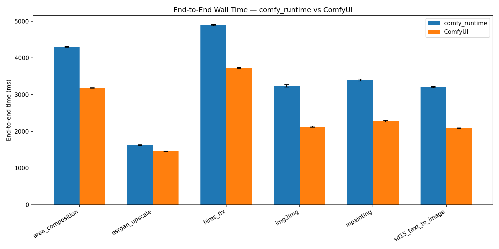
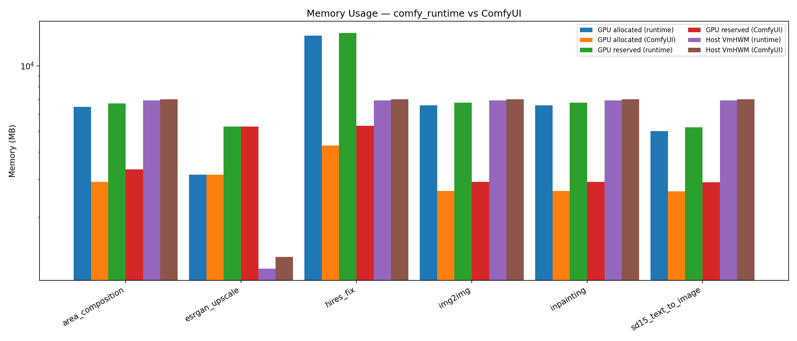

# comfy_runtime vs ComfyUI — End-to-End Benchmark

> Generated by `benchmarks/e2e/aggregate.py` on 2026-04-10T13:02:22.637964Z.

## TL;DR

3 timed runs per side, 6 workflow(s).
See per-workflow pages below for stage-level breakdowns.

## Environment

| Key | Value |
|---|---|
| GPU | NVIDIA GeForce RTX 4090 (24080 MB) |
| Driver | 580.65.06 |
| CUDA | 13.0 |
| torch | 2.11.0+cu130 |
| Python | 3.13.7 |
| comfy_runtime | 0.3.1 |
| ComfyUI commit | b615af1c |
| Hostname | jazz1 |

## Methodology

- Protocol: 1 warmup + 3 timed runs per (workflow, side), each run in a fresh
  subprocess.
- Per-node `torch.cuda.synchronize()` on both sides for accurate attribution
  (both sides pay this cost equally).
- Memory: `torch.cuda.max_memory_{allocated,reserved}` + `/proc/self/status`
  VmHWM.
- Seed: 42 (fixed), `CUBLAS_WORKSPACE_CONFIG=:4096:8` for deterministic cublas
  workspace.
- Report min/mean/median/stddev for every metric.

## Summary

| Workflow | E2E runtime (ms) | E2E ComfyUI (ms) | Speedup | GPU peak runtime (MB) | GPU peak ComfyUI (MB) | VmHWM runtime (MB) | VmHWM ComfyUI (MB) |
|---|---|---|---|---|---|---|---|
| [area_composition](workflows/area_composition.md) | 4300.1 | 3181.7 | 0.74x | 6465.8 | 2913.5 | 6916.2 | 7016.5 |
| [esrgan_upscale](workflows/esrgan_upscale.md) | 1623.9 | 1455.6 | 0.90x | 3139.1 | 3139.1 | 1159.3 | 1311.4 |
| [hires_fix](workflows/hires_fix.md) | 4893.4 | 3725.9 | 0.76x | 13759.8 | 4283.7 | 6914.8 | 7017.0 |
| [img2img](workflows/img2img.md) | 3237.4 | 2125.5 | 0.66x | 6565.6 | 2645.5 | 6914.8 | 7016.0 |
| [inpainting](workflows/inpainting.md) | 3393.1 | 2278.5 | 0.67x | 6565.6 | 2645.5 | 6916.8 | 7016.0 |
| [sd15_text_to_image](workflows/sd15_text_to_image.md) | 3201.9 | 2085.8 | 0.65x | 5007.0 | 2639.5 | 6915.6 | 7016.8 |


## Figures





## Per-workflow details

- [area_composition](workflows/area_composition.md)
- [esrgan_upscale](workflows/esrgan_upscale.md)
- [hires_fix](workflows/hires_fix.md)
- [img2img](workflows/img2img.md)
- [inpainting](workflows/inpainting.md)
- [sd15_text_to_image](workflows/sd15_text_to_image.md)


## Reproducing

```bash
cd benchmarks/e2e
uv sync --project runtime-env/pyproject.toml
uv sync --project comfyui-env/pyproject.toml
python verify.py          # correctness gate
python run_all.py         # full benchmark
python aggregate.py results/latest
```