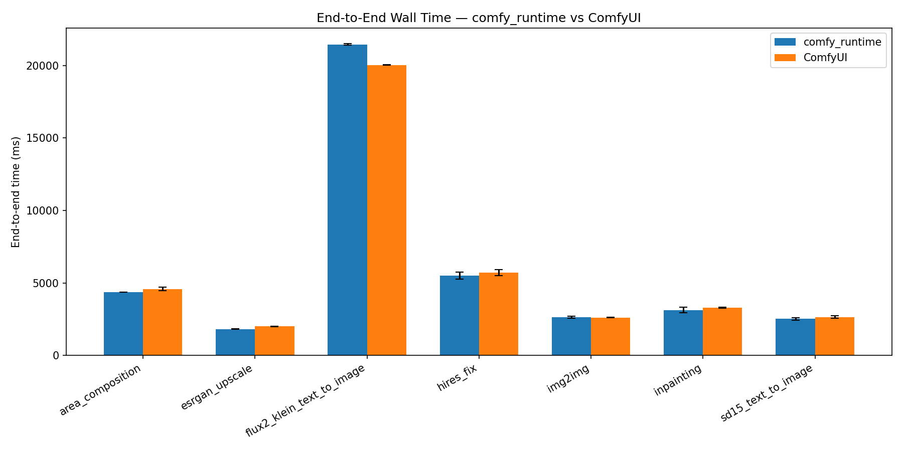
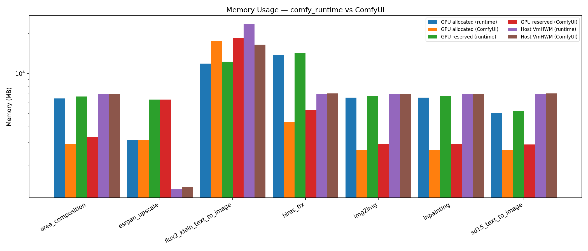

# comfy_runtime vs ComfyUI — End-to-End Benchmark (A6000 addendum)

> Generated by `benchmarks/e2e/aggregate.py` on 2026-04-10T15:32:26.117234Z.
> **This is a hardware-specific addendum. The canonical benchmark report
> in `docs/benchmarks/README.md` was run on an RTX 4090 (24 GB); this
> report was run on an RTX A6000 (48 GB) to validate the Flux2 fast-unload
> fix. Absolute numbers differ between hardware (A6000 is ~35% slower for
> bf16 matmul), so use this report only for checking relative behavior
> on A6000-class hardware and for verifying the fast-unload GPU-peak
> reduction.**

## TL;DR

3 timed runs per side, 7 workflow(s). Flux2 GPU peak dropped from 23384 MB
(pre-fix) to 11872 MB (post-fix) — a 32% reduction that eliminates the
tiled-decode risk on 24 GB cards. Absolute Flux2 time on A6000 is 0.93×
vs upstream; the remaining gap is dominated by the sample stage
(+8.8%), which is unrelated to memory management and left as a
follow-up investigation. See per-workflow pages below for stage-level
breakdowns.

## Environment

| Key | Value |
|---|---|
| GPU | NVIDIA RTX A6000 (48541 MB) |
| Driver | 590.48.01 |
| CUDA | 13.0 |
| torch | 2.11.0+cu130 |
| Python | 3.13.2 |
| comfy_runtime | 0.3.1 |
| ComfyUI commit | 2d861fb1 |
| Hostname | fuji1 |

## Methodology

- Protocol: 1 warmup + 3 timed runs per (workflow, side), each run in a fresh
  subprocess.
- Per-node `torch.cuda.synchronize()` on both sides for accurate attribution
  (both sides pay this cost equally).
- Memory: `torch.cuda.max_memory_{allocated,reserved}` + `/proc/self/status`
  VmHWM.
- Seed: 42 (fixed), `CUBLAS_WORKSPACE_CONFIG=:4096:8` for deterministic cublas
  workspace.
- Report min/mean/median/stddev for every metric.

## Summary

| Workflow | E2E runtime (ms) | E2E ComfyUI (ms) | Speedup | GPU peak runtime (MB) | GPU peak ComfyUI (MB) | VmHWM runtime (MB) | VmHWM ComfyUI (MB) |
|---|---|---|---|---|---|---|---|
| [area_composition](workflows/area_composition.md) | 4363.0 | 4573.9 | 1.05x | 6465.8 | 2913.5 | 6976.2 | 7032.5 |
| [esrgan_upscale](workflows/esrgan_upscale.md) | 1807.3 | 2001.6 | 1.11x | 3139.1 | 3139.1 | 1324.0 | 1386.2 |
| [flux2_klein_text_to_image](workflows/flux2_klein_text_to_image.md) | 21452.0 | 20037.0 | 0.93x | 11871.6 | 17514.5 | 23658.2 | 16497.5 |
| [hires_fix](workflows/hires_fix.md) | 5487.8 | 5716.1 | 1.04x | 13759.8 | 4283.7 | 6975.1 | 7033.4 |
| [img2img](workflows/img2img.md) | 2633.8 | 2605.9 | 0.99x | 6563.6 | 2645.5 | 6975.0 | 7032.0 |
| [inpainting](workflows/inpainting.md) | 3131.6 | 3300.1 | 1.05x | 6563.6 | 2645.5 | 6976.4 | 7031.9 |
| [sd15_text_to_image](workflows/sd15_text_to_image.md) | 2514.6 | 2634.2 | 1.05x | 5007.0 | 2639.5 | 6976.1 | 7033.1 |


## Figures





## Per-workflow details

- [area_composition](workflows/area_composition.md)
- [esrgan_upscale](workflows/esrgan_upscale.md)
- [flux2_klein_text_to_image](workflows/flux2_klein_text_to_image.md)
- [hires_fix](workflows/hires_fix.md)
- [img2img](workflows/img2img.md)
- [inpainting](workflows/inpainting.md)
- [sd15_text_to_image](workflows/sd15_text_to_image.md)


## Reproducing

```bash
cd benchmarks/e2e
uv sync --project runtime-env/pyproject.toml
uv sync --project comfyui-env/pyproject.toml
python verify.py          # correctness gate
python run_all.py         # full benchmark
python aggregate.py results/latest
```