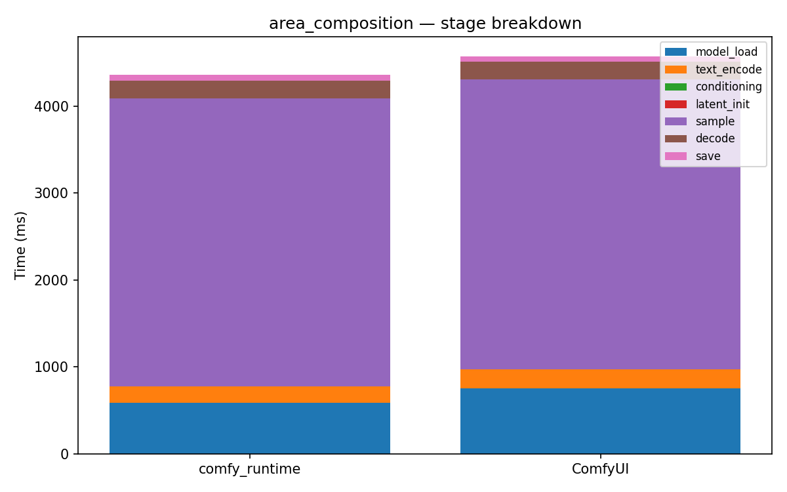

# area_composition

[← Back to summary](../README.md)

## Stage breakdown (mean +/- stddev, ms)

| Stage | comfy_runtime min | mean | median | stddev | ComfyUI min | mean | median | stddev | Δmean |
|---|---|---|---|---|---|---|---|---|---|
| model_load | 579.9 | 589.3 | 586.5 | 9.0 | 704.1 | 756.4 | 782.1 | 37.0 | -22.1% |
| text_encode | 183.2 | 184.9 | 183.4 | 2.3 | 175.9 | 215.5 | 185.8 | 49.1 | -14.2% |
| conditioning | 0.1 | 0.1 | 0.1 | 0.0 | 0.3 | 0.4 | 0.4 | 0.0 | -75.2% |
| latent_init | 0.1 | 0.1 | 0.1 | 0.0 | 0.3 | 0.3 | 0.3 | 0.0 | -73.2% |
| sample | 3303.4 | 3312.3 | 3310.2 | 8.2 | 3290.6 | 3333.1 | 3295.5 | 56.7 | -0.6% |
| decode | 206.3 | 208.7 | 209.4 | 1.8 | 201.3 | 204.1 | 201.8 | 3.7 | +2.3% |
| save | 60.9 | 62.8 | 63.3 | 1.4 | 60.3 | 61.3 | 61.0 | 0.9 | +2.4% |

| **total** | 4347.9 | 4363.0 | 4368.1 | 10.9 | 4450.8 | 4573.9 | 4525.4 | 125.1 | **-4.6%** |

## Memory

| Metric | comfy_runtime (MB) | ComfyUI (MB) | Δ |
|---|---|---|---|
| GPU max allocated | 6465.8 | 2913.5 | +121.9% |
| GPU max reserved  | 6692.0 | 3326.0 | +101.2% |
| Host VmHWM        | 6976.2 | 7032.5 | -0.8% |

## Per-node breakdown (mean, ms)

| Node | Call index | comfy_runtime | ComfyUI | Δ |
|---|---|---|---|---|
| CheckpointLoaderSimple | 0 | 589.3 | 756.4 | -22.1% |
| CLIPTextEncode | 0 | 130.7 | 163.5 | -20.1% |
| CLIPTextEncode | 1 | 18.6 | 17.9 | +3.8% |
| CLIPTextEncode | 2 | 17.6 | 17.0 | +3.5% |
| CLIPTextEncode | 3 | 18.0 | 17.0 | +5.6% |
| ConditioningSetArea | 0 | 0.0 | 0.1 | -58.8% |
| ConditioningSetArea | 1 | 0.0 | 0.1 | -84.2% |
| ConditioningCombine | 0 | 0.0 | 0.1 | -76.8% |
| ConditioningCombine | 1 | 0.0 | 0.1 | -84.4% |
| EmptyLatentImage | 0 | 0.1 | 0.3 | -73.2% |
| KSampler | 0 | 3312.3 | 3333.1 | -0.6% |
| VAEDecode | 0 | 208.7 | 204.1 | +2.3% |
| SaveImage | 0 | 62.8 | 61.3 | +2.4% |

## Raw data

- [area_composition_comfyui_0.json](../data/area_composition_comfyui_0.json)
- [area_composition_comfyui_1.json](../data/area_composition_comfyui_1.json)
- [area_composition_comfyui_2.json](../data/area_composition_comfyui_2.json)
- [area_composition_comfyui_3.json](../data/area_composition_comfyui_3.json)
- [area_composition_runtime_0.json](../data/area_composition_runtime_0.json)
- [area_composition_runtime_1.json](../data/area_composition_runtime_1.json)
- [area_composition_runtime_2.json](../data/area_composition_runtime_2.json)
- [area_composition_runtime_3.json](../data/area_composition_runtime_3.json)
