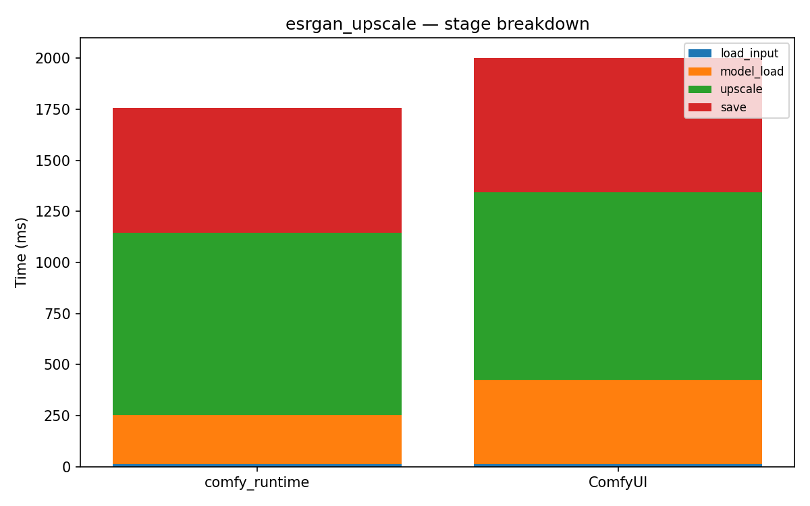

# esrgan_upscale

[← Back to summary](../README.md)

## Stage breakdown (mean +/- stddev, ms)

| Stage | comfy_runtime min | mean | median | stddev | ComfyUI min | mean | median | stddev | Δmean |
|---|---|---|---|---|---|---|---|---|---|
| load_input | 12.3 | 12.4 | 12.4 | 0.1 | 12.5 | 12.6 | 12.5 | 0.1 | -1.4% |
| model_load | 237.2 | 240.9 | 241.3 | 2.8 | 386.2 | 411.7 | 417.1 | 19.0 | -41.5% |
| upscale | 882.9 | 892.5 | 887.1 | 10.7 | 914.2 | 920.2 | 921.0 | 4.6 | -3.0% |
| save | 597.8 | 609.9 | 613.1 | 8.9 | 650.6 | 655.2 | 656.6 | 3.3 | -6.9% |

| **total** | 1790.5 | 1807.3 | 1800.3 | 17.3 | 1984.4 | 2001.6 | 2003.3 | 13.4 | **-9.7%** |

## Memory

| Metric | comfy_runtime (MB) | ComfyUI (MB) | Δ |
|---|---|---|---|
| GPU max allocated | 3139.1 | 3139.1 | +0.0% |
| GPU max reserved  | 6342.0 | 6342.0 | +0.0% |
| Host VmHWM        | 1324.0 | 1386.2 | -4.5% |

## Per-node breakdown (mean, ms)

| Node | Call index | comfy_runtime | ComfyUI | Δ |
|---|---|---|---|---|
| LoadImage | 0 | 12.4 | 12.6 | -1.4% |
| UpscaleModelLoader | 0 | 240.9 | 411.7 | -41.5% |
| ImageUpscaleWithModel | 0 | 892.5 | 920.2 | -3.0% |
| SaveImage | 0 | 609.9 | 655.2 | -6.9% |

## Raw data

- [esrgan_upscale_comfyui_0.json](../data/esrgan_upscale_comfyui_0.json)
- [esrgan_upscale_comfyui_1.json](../data/esrgan_upscale_comfyui_1.json)
- [esrgan_upscale_comfyui_2.json](../data/esrgan_upscale_comfyui_2.json)
- [esrgan_upscale_comfyui_3.json](../data/esrgan_upscale_comfyui_3.json)
- [esrgan_upscale_runtime_0.json](../data/esrgan_upscale_runtime_0.json)
- [esrgan_upscale_runtime_1.json](../data/esrgan_upscale_runtime_1.json)
- [esrgan_upscale_runtime_2.json](../data/esrgan_upscale_runtime_2.json)
- [esrgan_upscale_runtime_3.json](../data/esrgan_upscale_runtime_3.json)
