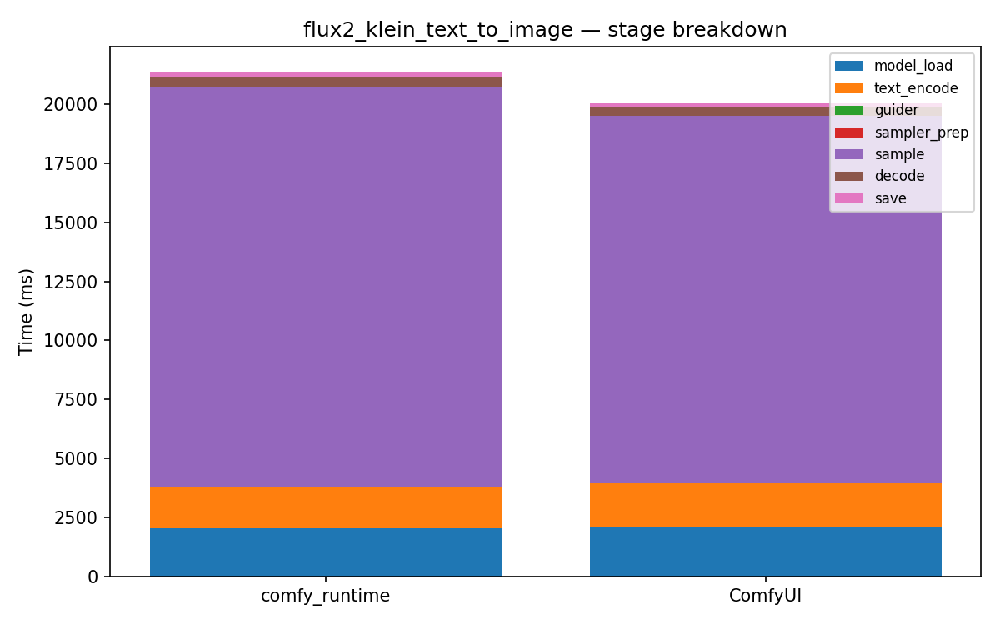

# flux2_klein_text_to_image

[← Back to summary](../README.md)

## Stage breakdown (mean +/- stddev, ms)

| Stage | comfy_runtime min | mean | median | stddev | ComfyUI min | mean | median | stddev | Δmean |
|---|---|---|---|---|---|---|---|---|---|
| model_load | 2001.8 | 2019.8 | 2028.2 | 12.8 | 2055.4 | 2079.2 | 2068.1 | 25.2 | -2.9% |
| text_encode | 1760.6 | 1793.3 | 1768.9 | 40.6 | 1837.6 | 1859.9 | 1843.4 | 27.5 | -3.6% |
| guider | 0.1 | 0.1 | 0.1 | 0.0 | 0.4 | 0.4 | 0.4 | 0.0 | -70.3% |
| sampler_prep | 0.6 | 0.6 | 0.6 | 0.0 | 3.4 | 3.7 | 3.4 | 0.4 | -83.1% |
| sample | 16876.0 | 16917.2 | 16922.7 | 31.6 | 15550.1 | 15555.1 | 15554.8 | 4.2 | +8.8% |
| decode | 439.4 | 449.9 | 445.4 | 10.9 | 344.5 | 345.4 | 345.2 | 0.8 | +30.3% |
| save | 180.7 | 185.4 | 184.9 | 4.0 | 187.6 | 189.6 | 189.1 | 1.9 | -2.2% |

| **total** | 21389.8 | 21452.0 | 21435.4 | 58.7 | 20005.3 | 20037.0 | 20042.0 | 24.1 | **+7.1%** |

## Memory

| Metric | comfy_runtime (MB) | ComfyUI (MB) | Δ |
|---|---|---|---|
| GPU max allocated | 11871.6 | 17514.5 | -32.2% |
| GPU max reserved  | 12250.0 | 18472.0 | -33.7% |
| Host VmHWM        | 23658.2 | 16497.5 | +43.4% |

## Per-node breakdown (mean, ms)

| Node | Call index | comfy_runtime | ComfyUI | Δ |
|---|---|---|---|---|
| UNETLoader | 0 | 783.7 | 814.3 | -3.8% |
| CLIPLoader | 0 | 1064.7 | 1125.8 | -5.4% |
| VAELoader | 0 | 171.3 | 139.1 | +23.2% |
| CLIPTextEncode | 0 | 1518.2 | 1585.6 | -4.2% |
| CLIPTextEncode | 1 | 275.1 | 274.3 | +0.3% |
| CFGGuider | 0 | 0.1 | 0.4 | -70.3% |
| KSamplerSelect | 0 | 0.0 | 0.2 | -80.3% |
| Flux2Scheduler | 0 | 0.4 | 0.6 | -27.1% |
| EmptyFlux2LatentImage | 0 | 0.1 | 2.7 | -95.0% |
| RandomNoise | 0 | 0.0 | 0.2 | -87.5% |
| SamplerCustomAdvanced | 0 | 16917.2 | 15555.1 | +8.8% |
| VAEDecode | 0 | 449.9 | 345.4 | +30.3% |
| SaveImage | 0 | 185.4 | 189.6 | -2.2% |

## Raw data

- [flux2_klein_text_to_image_comfyui_0.json](../data/flux2_klein_text_to_image_comfyui_0.json)
- [flux2_klein_text_to_image_comfyui_1.json](../data/flux2_klein_text_to_image_comfyui_1.json)
- [flux2_klein_text_to_image_comfyui_2.json](../data/flux2_klein_text_to_image_comfyui_2.json)
- [flux2_klein_text_to_image_comfyui_3.json](../data/flux2_klein_text_to_image_comfyui_3.json)
- [flux2_klein_text_to_image_runtime_0.json](../data/flux2_klein_text_to_image_runtime_0.json)
- [flux2_klein_text_to_image_runtime_1.json](../data/flux2_klein_text_to_image_runtime_1.json)
- [flux2_klein_text_to_image_runtime_2.json](../data/flux2_klein_text_to_image_runtime_2.json)
- [flux2_klein_text_to_image_runtime_3.json](../data/flux2_klein_text_to_image_runtime_3.json)
