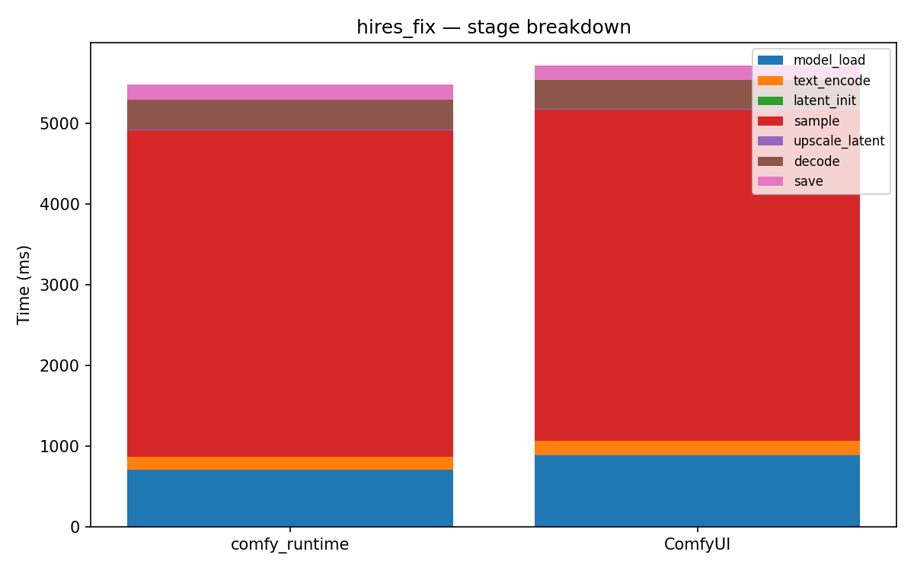

# hires_fix

[← Back to summary](../README.md)

## Stage breakdown (mean +/- stddev, ms)

| Stage | comfy_runtime min | mean | median | stddev | ComfyUI min | mean | median | stddev | Δmean |
|---|---|---|---|---|---|---|---|---|---|
| model_load | 621.7 | 708.7 | 726.5 | 65.0 | 780.8 | 885.3 | 885.2 | 85.3 | -19.9% |
| text_encode | 151.0 | 160.1 | 152.8 | 11.8 | 152.1 | 174.4 | 152.7 | 31.1 | -8.2% |
| latent_init | 0.1 | 0.1 | 0.1 | 0.0 | 0.3 | 0.4 | 0.4 | 0.1 | -74.9% |
| sample | 3836.1 | 4048.1 | 4136.9 | 150.6 | 3979.9 | 4111.6 | 4171.8 | 93.2 | -1.5% |
| upscale_latent | 0.3 | 4.3 | 3.9 | 3.5 | 0.3 | 2.2 | 0.4 | 2.6 | +96.6% |
| decode | 349.5 | 371.0 | 359.5 | 23.7 | 347.2 | 360.1 | 355.8 | 12.7 | +3.0% |
| save | 171.1 | 189.0 | 177.1 | 21.2 | 174.6 | 179.2 | 178.5 | 4.0 | +5.5% |

| **total** | 5144.0 | 5487.8 | 5640.9 | 243.6 | 5451.0 | 5716.1 | 5751.9 | 203.4 | **-4.0%** |

## Memory

| Metric | comfy_runtime (MB) | ComfyUI (MB) | Δ |
|---|---|---|---|
| GPU max allocated | 13759.8 | 4283.7 | +221.2% |
| GPU max reserved  | 14174.0 | 5278.0 | +168.5% |
| Host VmHWM        | 6975.1 | 7033.4 | -0.8% |

## Per-node breakdown (mean, ms)

| Node | Call index | comfy_runtime | ComfyUI | Δ |
|---|---|---|---|---|
| CheckpointLoaderSimple | 0 | 708.7 | 885.3 | -19.9% |
| CLIPTextEncode | 0 | 139.1 | 153.3 | -9.3% |
| CLIPTextEncode | 1 | 21.1 | 21.1 | +0.0% |
| EmptyLatentImage | 0 | 0.1 | 0.4 | -74.9% |
| KSampler | 0 | 1632.5 | 1694.1 | -3.6% |
| LatentUpscale | 0 | 4.3 | 2.2 | +96.6% |
| KSampler | 1 | 2415.6 | 2417.6 | -0.1% |
| VAEDecode | 0 | 371.0 | 360.1 | +3.0% |
| SaveImage | 0 | 189.0 | 179.2 | +5.5% |

## Raw data

- [hires_fix_comfyui_0.json](../data/hires_fix_comfyui_0.json)
- [hires_fix_comfyui_1.json](../data/hires_fix_comfyui_1.json)
- [hires_fix_comfyui_2.json](../data/hires_fix_comfyui_2.json)
- [hires_fix_comfyui_3.json](../data/hires_fix_comfyui_3.json)
- [hires_fix_runtime_0.json](../data/hires_fix_runtime_0.json)
- [hires_fix_runtime_1.json](../data/hires_fix_runtime_1.json)
- [hires_fix_runtime_2.json](../data/hires_fix_runtime_2.json)
- [hires_fix_runtime_3.json](../data/hires_fix_runtime_3.json)
