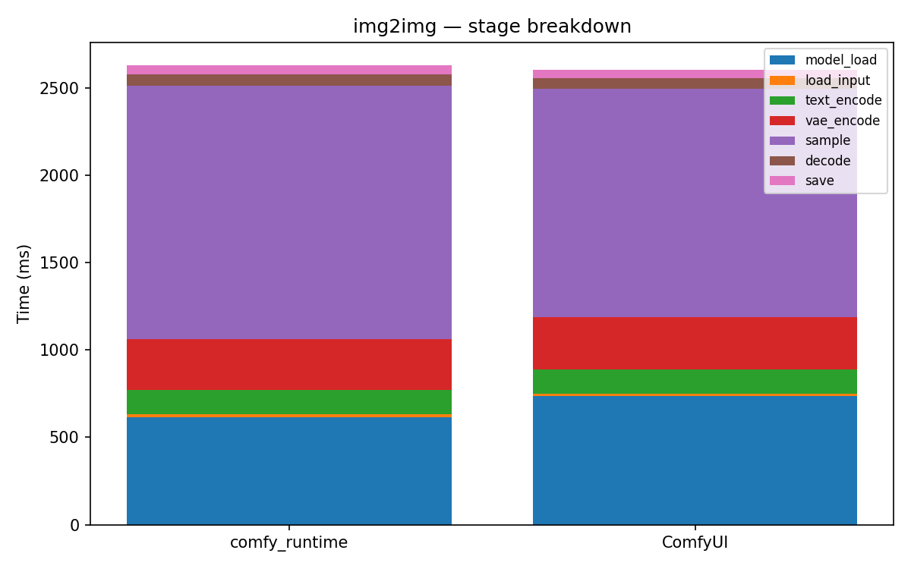

# img2img

[← Back to summary](../README.md)

## Stage breakdown (mean +/- stddev, ms)

| Stage | comfy_runtime min | mean | median | stddev | ComfyUI min | mean | median | stddev | Δmean |
|---|---|---|---|---|---|---|---|---|---|
| model_load | 595.5 | 614.4 | 595.7 | 26.6 | 721.6 | 736.2 | 723.3 | 19.5 | -16.5% |
| load_input | 9.9 | 15.9 | 10.0 | 8.5 | 11.4 | 11.5 | 11.5 | 0.0 | +38.9% |
| text_encode | 138.7 | 139.1 | 139.2 | 0.3 | 136.2 | 142.0 | 142.6 | 4.5 | -2.1% |
| vae_encode | 289.6 | 292.6 | 292.3 | 2.6 | 287.2 | 299.4 | 294.9 | 12.1 | -2.3% |
| sample | 1373.8 | 1451.1 | 1458.0 | 60.5 | 1276.3 | 1305.5 | 1307.4 | 23.0 | +11.2% |
| decode | 63.0 | 64.4 | 63.6 | 1.6 | 58.8 | 59.1 | 59.2 | 0.2 | +8.9% |
| save | 48.2 | 49.6 | 48.6 | 1.7 | 49.1 | 49.5 | 49.6 | 0.3 | +0.2% |

| **total** | 2547.1 | 2633.8 | 2613.9 | 80.2 | 2586.8 | 2605.9 | 2590.7 | 24.3 | **+1.1%** |

## Memory

| Metric | comfy_runtime (MB) | ComfyUI (MB) | Δ |
|---|---|---|---|
| GPU max allocated | 6563.6 | 2645.5 | +148.1% |
| GPU max reserved  | 6760.0 | 2908.0 | +132.5% |
| Host VmHWM        | 6975.0 | 7032.0 | -0.8% |

## Per-node breakdown (mean, ms)

| Node | Call index | comfy_runtime | ComfyUI | Δ |
|---|---|---|---|---|
| CheckpointLoaderSimple | 0 | 614.4 | 736.2 | -16.5% |
| LoadImage | 0 | 15.9 | 11.5 | +38.9% |
| VAEEncode | 0 | 292.6 | 299.4 | -2.3% |
| CLIPTextEncode | 0 | 120.0 | 123.4 | -2.8% |
| CLIPTextEncode | 1 | 19.1 | 18.6 | +2.5% |
| KSampler | 0 | 1451.1 | 1305.5 | +11.2% |
| VAEDecode | 0 | 64.4 | 59.1 | +8.9% |
| SaveImage | 0 | 49.6 | 49.5 | +0.2% |

## Raw data

- [img2img_comfyui_0.json](../data/img2img_comfyui_0.json)
- [img2img_comfyui_1.json](../data/img2img_comfyui_1.json)
- [img2img_comfyui_2.json](../data/img2img_comfyui_2.json)
- [img2img_comfyui_3.json](../data/img2img_comfyui_3.json)
- [img2img_runtime_0.json](../data/img2img_runtime_0.json)
- [img2img_runtime_1.json](../data/img2img_runtime_1.json)
- [img2img_runtime_2.json](../data/img2img_runtime_2.json)
- [img2img_runtime_3.json](../data/img2img_runtime_3.json)
