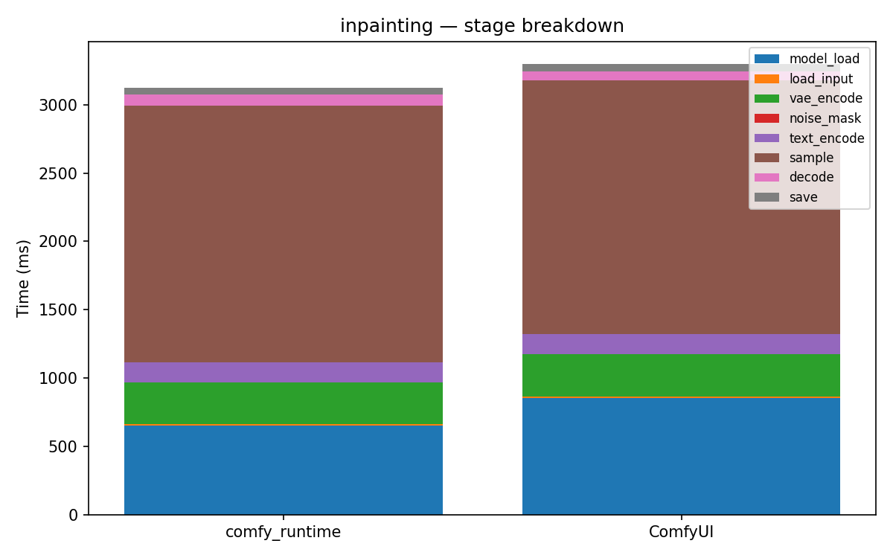

# inpainting

[← Back to summary](../README.md)

## Stage breakdown (mean +/- stddev, ms)

| Stage | comfy_runtime min | mean | median | stddev | ComfyUI min | mean | median | stddev | Δmean |
|---|---|---|---|---|---|---|---|---|---|
| model_load | 591.2 | 652.1 | 666.0 | 45.2 | 805.3 | 851.1 | 814.4 | 58.4 | -23.4% |
| load_input | 9.9 | 10.1 | 10.0 | 0.2 | 11.3 | 11.8 | 11.4 | 0.6 | -14.5% |
| vae_encode | 303.0 | 303.5 | 303.4 | 0.4 | 307.5 | 314.1 | 308.6 | 8.5 | -3.4% |
| noise_mask | 0.1 | 0.1 | 0.1 | 0.0 | 0.1 | 0.1 | 0.1 | 0.0 | -47.4% |
| text_encode | 146.0 | 151.0 | 146.9 | 6.5 | 141.4 | 143.4 | 142.2 | 2.3 | +5.3% |
| sample | 1691.8 | 1876.8 | 1968.2 | 130.8 | 1763.8 | 1859.1 | 1859.7 | 77.6 | +1.0% |
| decode | 61.4 | 83.1 | 74.2 | 22.3 | 60.4 | 66.8 | 64.2 | 6.6 | +24.3% |
| save | 44.1 | 48.2 | 44.7 | 5.4 | 46.6 | 50.7 | 51.4 | 3.1 | -5.0% |

| **total** | 2855.4 | 3131.6 | 3251.8 | 195.9 | 3260.9 | 3300.1 | 3299.5 | 32.2 | **-5.1%** |

## Memory

| Metric | comfy_runtime (MB) | ComfyUI (MB) | Δ |
|---|---|---|---|
| GPU max allocated | 6563.6 | 2645.5 | +148.1% |
| GPU max reserved  | 6760.0 | 2908.0 | +132.5% |
| Host VmHWM        | 6976.4 | 7031.9 | -0.8% |

## Per-node breakdown (mean, ms)

| Node | Call index | comfy_runtime | ComfyUI | Δ |
|---|---|---|---|---|
| CheckpointLoaderSimple | 0 | 652.1 | 851.1 | -23.4% |
| LoadImage | 0 | 10.1 | 11.8 | -14.5% |
| VAEEncode | 0 | 303.5 | 314.1 | -3.4% |
| SetLatentNoiseMask | 0 | 0.1 | 0.1 | -47.4% |
| CLIPTextEncode | 0 | 127.6 | 123.7 | +3.1% |
| CLIPTextEncode | 1 | 23.4 | 19.6 | +19.1% |
| KSampler | 0 | 1876.8 | 1859.1 | +1.0% |
| VAEDecode | 0 | 83.1 | 66.8 | +24.3% |
| SaveImage | 0 | 48.2 | 50.7 | -5.0% |

## Raw data

- [inpainting_comfyui_0.json](../data/inpainting_comfyui_0.json)
- [inpainting_comfyui_1.json](../data/inpainting_comfyui_1.json)
- [inpainting_comfyui_2.json](../data/inpainting_comfyui_2.json)
- [inpainting_comfyui_3.json](../data/inpainting_comfyui_3.json)
- [inpainting_runtime_0.json](../data/inpainting_runtime_0.json)
- [inpainting_runtime_1.json](../data/inpainting_runtime_1.json)
- [inpainting_runtime_2.json](../data/inpainting_runtime_2.json)
- [inpainting_runtime_3.json](../data/inpainting_runtime_3.json)
