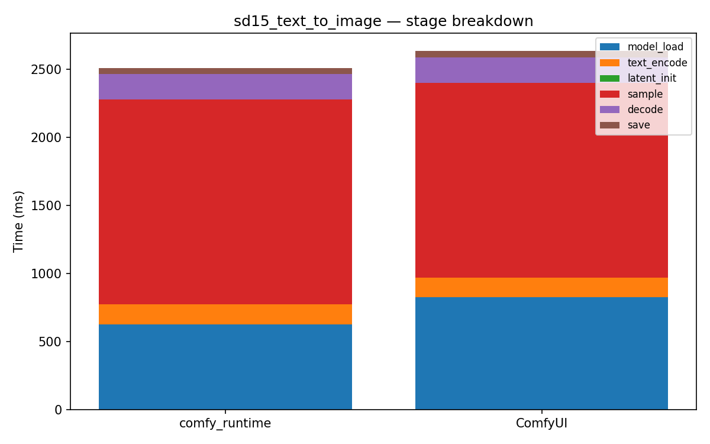

# sd15_text_to_image

[← Back to summary](../README.md)

## Stage breakdown (mean +/- stddev, ms)

| Stage | comfy_runtime min | mean | median | stddev | ComfyUI min | mean | median | stddev | Δmean |
|---|---|---|---|---|---|---|---|---|---|
| model_load | 600.4 | 623.9 | 633.3 | 16.8 | 737.8 | 823.9 | 787.4 | 89.0 | -24.3% |
| text_encode | 146.1 | 148.8 | 148.7 | 2.2 | 142.0 | 144.1 | 143.5 | 2.0 | +3.3% |
| latent_init | 0.1 | 0.1 | 0.1 | 0.0 | 0.3 | 0.3 | 0.3 | 0.0 | -71.0% |
| sample | 1420.1 | 1503.5 | 1448.3 | 98.7 | 1422.4 | 1431.1 | 1426.1 | 9.9 | +5.1% |
| decode | 183.0 | 186.3 | 186.9 | 2.4 | 180.2 | 184.8 | 186.4 | 3.3 | +0.8% |
| save | 45.9 | 46.7 | 46.4 | 0.8 | 47.9 | 48.1 | 48.0 | 0.3 | -2.9% |

| **total** | 2445.0 | 2514.6 | 2474.0 | 78.8 | 2538.7 | 2634.2 | 2617.4 | 85.7 | **-4.5%** |

## Memory

| Metric | comfy_runtime (MB) | ComfyUI (MB) | Δ |
|---|---|---|---|
| GPU max allocated | 5007.0 | 2639.5 | +89.7% |
| GPU max reserved  | 5202.0 | 2896.0 | +79.6% |
| Host VmHWM        | 6976.1 | 7033.1 | -0.8% |

## Per-node breakdown (mean, ms)

| Node | Call index | comfy_runtime | ComfyUI | Δ |
|---|---|---|---|---|
| CheckpointLoaderSimple | 0 | 623.9 | 823.9 | -24.3% |
| CLIPTextEncode | 0 | 130.0 | 126.4 | +2.8% |
| CLIPTextEncode | 1 | 18.8 | 17.7 | +6.7% |
| EmptyLatentImage | 0 | 0.1 | 0.3 | -71.0% |
| KSampler | 0 | 1503.5 | 1431.1 | +5.1% |
| VAEDecode | 0 | 186.3 | 184.8 | +0.8% |
| SaveImage | 0 | 46.7 | 48.1 | -2.9% |

## Raw data

- [sd15_text_to_image_comfyui_0.json](../data/sd15_text_to_image_comfyui_0.json)
- [sd15_text_to_image_comfyui_1.json](../data/sd15_text_to_image_comfyui_1.json)
- [sd15_text_to_image_comfyui_2.json](../data/sd15_text_to_image_comfyui_2.json)
- [sd15_text_to_image_comfyui_3.json](../data/sd15_text_to_image_comfyui_3.json)
- [sd15_text_to_image_runtime_0.json](../data/sd15_text_to_image_runtime_0.json)
- [sd15_text_to_image_runtime_1.json](../data/sd15_text_to_image_runtime_1.json)
- [sd15_text_to_image_runtime_2.json](../data/sd15_text_to_image_runtime_2.json)
- [sd15_text_to_image_runtime_3.json](../data/sd15_text_to_image_runtime_3.json)
