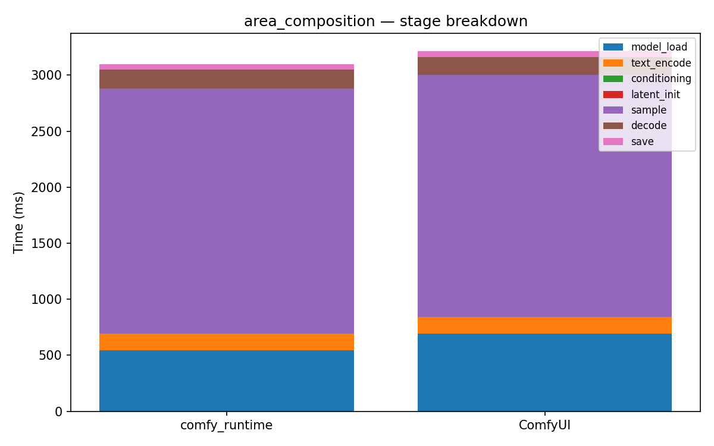

# area_composition

[← Back to summary](../README.md)

## Stage breakdown (mean +/- stddev, ms)

| Stage | comfy_runtime min | mean | median | stddev | ComfyUI min | mean | median | stddev | Δmean |
|---|---|---|---|---|---|---|---|---|---|
| model_load | 537.9 | 546.0 | 545.9 | 6.6 | 672.1 | 693.0 | 703.1 | 14.8 | -21.2% |
| text_encode | 148.1 | 149.5 | 148.6 | 1.7 | 144.8 | 146.5 | 147.1 | 1.2 | +2.1% |
| conditioning | 0.1 | 0.1 | 0.1 | 0.0 | 0.2 | 0.2 | 0.2 | 0.0 | -75.3% |
| latent_init | 0.1 | 0.1 | 0.1 | 0.0 | 0.2 | 0.2 | 0.2 | 0.0 | -73.0% |
| sample | 2161.1 | 2185.5 | 2162.4 | 33.6 | 2156.8 | 2161.7 | 2160.4 | 4.6 | +1.1% |
| decode | 166.2 | 166.4 | 166.5 | 0.2 | 159.9 | 160.7 | 160.6 | 0.6 | +3.6% |
| save | 48.3 | 48.8 | 48.4 | 0.6 | 49.3 | 49.8 | 49.7 | 0.5 | -2.1% |

| **total** | 3070.5 | 3100.0 | 3075.1 | 38.4 | 3189.9 | 3214.1 | 3221.1 | 17.6 | **-3.6%** |

## Memory

| Metric | comfy_runtime (MB) | ComfyUI (MB) | Δ |
|---|---|---|---|
| GPU max allocated | 6465.8 | 2913.5 | +121.9% |
| GPU max reserved  | 6692.0 | 3326.0 | +101.2% |
| Host VmHWM        | 6958.6 | 7015.0 | -0.8% |

## Per-node breakdown (mean, ms)

| Node | Call index | comfy_runtime | ComfyUI | Δ |
|---|---|---|---|---|
| CheckpointLoaderSimple | 0 | 546.0 | 693.0 | -21.2% |
| CLIPTextEncode | 0 | 108.7 | 108.4 | +0.4% |
| CLIPTextEncode | 1 | 14.1 | 13.2 | +6.4% |
| CLIPTextEncode | 2 | 13.3 | 12.5 | +6.3% |
| CLIPTextEncode | 3 | 13.4 | 12.4 | +8.0% |
| ConditioningSetArea | 0 | 0.0 | 0.1 | -57.6% |
| ConditioningSetArea | 1 | 0.0 | 0.1 | -84.7% |
| ConditioningCombine | 0 | 0.0 | 0.1 | -78.0% |
| ConditioningCombine | 1 | 0.0 | 0.0 | -86.2% |
| EmptyLatentImage | 0 | 0.1 | 0.2 | -73.0% |
| KSampler | 0 | 2185.5 | 2161.7 | +1.1% |
| VAEDecode | 0 | 166.4 | 160.7 | +3.6% |
| SaveImage | 0 | 48.8 | 49.8 | -2.1% |

## Raw data

- [area_composition_comfyui_0.json](../data/area_composition_comfyui_0.json)
- [area_composition_comfyui_1.json](../data/area_composition_comfyui_1.json)
- [area_composition_comfyui_2.json](../data/area_composition_comfyui_2.json)
- [area_composition_comfyui_3.json](../data/area_composition_comfyui_3.json)
- [area_composition_runtime_0.json](../data/area_composition_runtime_0.json)
- [area_composition_runtime_1.json](../data/area_composition_runtime_1.json)
- [area_composition_runtime_2.json](../data/area_composition_runtime_2.json)
- [area_composition_runtime_3.json](../data/area_composition_runtime_3.json)
