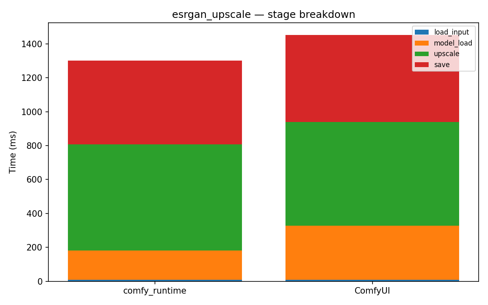

# esrgan_upscale

[← Back to summary](../README.md)

## Stage breakdown (mean +/- stddev, ms)

| Stage | comfy_runtime min | mean | median | stddev | ComfyUI min | mean | median | stddev | Δmean |
|---|---|---|---|---|---|---|---|---|---|
| load_input | 9.5 | 9.6 | 9.6 | 0.1 | 9.6 | 9.9 | 9.9 | 0.2 | -2.2% |
| model_load | 170.2 | 172.0 | 170.9 | 2.0 | 310.1 | 316.8 | 314.8 | 6.4 | -45.7% |
| upscale | 617.6 | 626.3 | 626.8 | 7.0 | 610.7 | 613.2 | 613.1 | 2.1 | +2.1% |
| save | 494.0 | 494.2 | 494.2 | 0.2 | 497.8 | 511.8 | 518.6 | 9.9 | -3.4% |

| **total** | 1332.3 | 1337.7 | 1336.9 | 4.8 | 1429.6 | 1453.1 | 1457.9 | 17.5 | **-7.9%** |

## Memory

| Metric | comfy_runtime (MB) | ComfyUI (MB) | Δ |
|---|---|---|---|
| GPU max allocated | 3139.1 | 3139.1 | +0.0% |
| GPU max reserved  | 5252.0 | 5252.0 | +0.0% |
| Host VmHWM        | 1235.9 | 1311.3 | -5.7% |

## Per-node breakdown (mean, ms)

| Node | Call index | comfy_runtime | ComfyUI | Δ |
|---|---|---|---|---|
| LoadImage | 0 | 9.6 | 9.9 | -2.2% |
| UpscaleModelLoader | 0 | 172.0 | 316.8 | -45.7% |
| ImageUpscaleWithModel | 0 | 626.3 | 613.2 | +2.1% |
| SaveImage | 0 | 494.2 | 511.8 | -3.4% |

## Raw data

- [esrgan_upscale_comfyui_0.json](../data/esrgan_upscale_comfyui_0.json)
- [esrgan_upscale_comfyui_1.json](../data/esrgan_upscale_comfyui_1.json)
- [esrgan_upscale_comfyui_2.json](../data/esrgan_upscale_comfyui_2.json)
- [esrgan_upscale_comfyui_3.json](../data/esrgan_upscale_comfyui_3.json)
- [esrgan_upscale_runtime_0.json](../data/esrgan_upscale_runtime_0.json)
- [esrgan_upscale_runtime_1.json](../data/esrgan_upscale_runtime_1.json)
- [esrgan_upscale_runtime_2.json](../data/esrgan_upscale_runtime_2.json)
- [esrgan_upscale_runtime_3.json](../data/esrgan_upscale_runtime_3.json)
