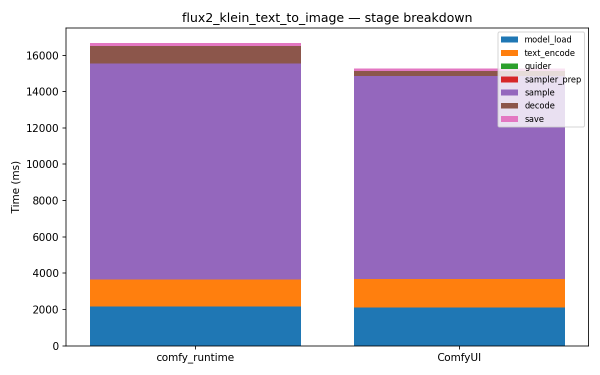

# flux2_klein_text_to_image

[← Back to summary](../README.md)

## Stage breakdown (mean +/- stddev, ms)

| Stage | comfy_runtime min | mean | median | stddev | ComfyUI min | mean | median | stddev | Δmean |
|---|---|---|---|---|---|---|---|---|---|
| model_load | 2163.9 | 2178.3 | 2182.6 | 10.5 | 2102.5 | 2121.6 | 2130.4 | 13.6 | +2.7% |
| text_encode | 1462.3 | 1469.8 | 1467.2 | 7.5 | 1543.0 | 1548.1 | 1544.7 | 6.0 | -5.1% |
| guider | 0.1 | 0.1 | 0.1 | 0.0 | 0.3 | 0.3 | 0.3 | 0.0 | -69.3% |
| sampler_prep | 0.3 | 0.3 | 0.3 | 0.0 | 2.6 | 3.2 | 3.4 | 0.4 | -90.5% |
| sample | 11887.4 | 11905.0 | 11904.7 | 14.5 | 11167.2 | 11196.3 | 11171.2 | 38.4 | +6.3% |
| decode | 968.2 | 971.1 | 971.3 | 2.3 | 255.8 | 256.2 | 255.8 | 0.6 | +279.0% |
| save | 143.5 | 144.3 | 144.3 | 0.7 | 148.1 | 148.4 | 148.4 | 0.2 | -2.7% |

| **total** | 16682.0 | 16695.8 | 16694.1 | 12.0 | 15224.7 | 15276.7 | 15257.7 | 52.0 | **+9.3%** |

## Memory

| Metric | comfy_runtime (MB) | ComfyUI (MB) | Δ |
|---|---|---|---|
| GPU max allocated | 23384.6 | 17514.5 | +33.5% |
| GPU max reserved  | 23510.0 | 18472.0 | +27.3% |
| Host VmHWM        | 23641.5 | 16471.5 | +43.5% |

## Per-node breakdown (mean, ms)

| Node | Call index | comfy_runtime | ComfyUI | Δ |
|---|---|---|---|---|
| UNETLoader | 0 | 882.0 | 885.6 | -0.4% |
| CLIPLoader | 0 | 1160.7 | 1140.3 | +1.8% |
| VAELoader | 0 | 135.6 | 95.8 | +41.6% |
| CLIPTextEncode | 0 | 1321.4 | 1402.5 | -5.8% |
| CLIPTextEncode | 1 | 148.4 | 145.6 | +2.0% |
| CFGGuider | 0 | 0.1 | 0.3 | -69.3% |
| KSamplerSelect | 0 | 0.0 | 0.2 | -81.0% |
| Flux2Scheduler | 0 | 0.2 | 0.5 | -69.7% |
| EmptyFlux2LatentImage | 0 | 0.1 | 2.4 | -95.7% |
| RandomNoise | 0 | 0.0 | 0.1 | -85.1% |
| SamplerCustomAdvanced | 0 | 11905.0 | 11196.3 | +6.3% |
| VAEDecode | 0 | 971.1 | 256.2 | +279.0% |
| SaveImage | 0 | 144.3 | 148.4 | -2.7% |

## Raw data

- [flux2_klein_text_to_image_comfyui_0.json](../data/flux2_klein_text_to_image_comfyui_0.json)
- [flux2_klein_text_to_image_comfyui_1.json](../data/flux2_klein_text_to_image_comfyui_1.json)
- [flux2_klein_text_to_image_comfyui_2.json](../data/flux2_klein_text_to_image_comfyui_2.json)
- [flux2_klein_text_to_image_comfyui_3.json](../data/flux2_klein_text_to_image_comfyui_3.json)
- [flux2_klein_text_to_image_runtime_0.json](../data/flux2_klein_text_to_image_runtime_0.json)
- [flux2_klein_text_to_image_runtime_1.json](../data/flux2_klein_text_to_image_runtime_1.json)
- [flux2_klein_text_to_image_runtime_2.json](../data/flux2_klein_text_to_image_runtime_2.json)
- [flux2_klein_text_to_image_runtime_3.json](../data/flux2_klein_text_to_image_runtime_3.json)
