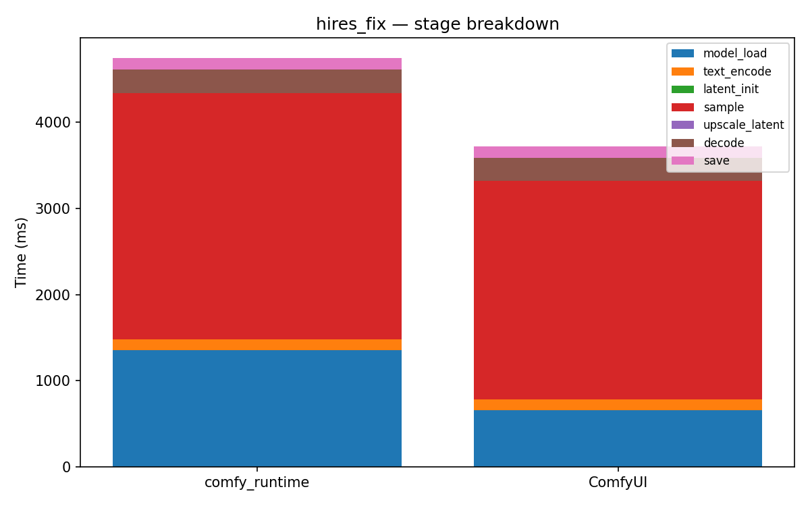

# hires_fix

[← Back to summary](../README.md)

## Stage breakdown (mean +/- stddev, ms)

| Stage | comfy_runtime min | mean | median | stddev | ComfyUI min | mean | median | stddev | Δmean |
|---|---|---|---|---|---|---|---|---|---|
| model_load | 1336.9 | 1354.0 | 1361.1 | 12.1 | 651.6 | 658.2 | 659.8 | 4.9 | +105.7% |
| text_encode | 122.7 | 123.1 | 122.9 | 0.4 | 119.0 | 120.7 | 119.8 | 1.9 | +2.0% |
| latent_init | 0.1 | 0.1 | 0.1 | 0.0 | 0.2 | 0.2 | 0.2 | 0.0 | -71.4% |
| sample | 2851.1 | 2860.7 | 2857.5 | 9.4 | 2537.4 | 2542.6 | 2538.5 | 6.6 | +12.5% |
| upscale_latent | 0.2 | 0.2 | 0.2 | 0.0 | 0.2 | 0.2 | 0.2 | 0.0 | -24.5% |
| decode | 272.4 | 273.0 | 273.2 | 0.4 | 262.3 | 263.6 | 263.4 | 1.2 | +3.5% |
| save | 134.1 | 134.2 | 134.2 | 0.1 | 137.9 | 138.7 | 138.2 | 0.9 | -3.3% |

| **total** | 4870.0 | 4893.4 | 4900.6 | 17.0 | 3714.6 | 3725.9 | 3722.7 | 10.8 | **+31.3%** |

## Memory

| Metric | comfy_runtime (MB) | ComfyUI (MB) | Δ |
|---|---|---|---|
| GPU max allocated | 13759.8 | 4283.7 | +221.2% |
| GPU max reserved  | 14174.0 | 5278.0 | +168.5% |
| Host VmHWM        | 6914.8 | 7017.0 | -1.5% |

## Per-node breakdown (mean, ms)

| Node | Call index | comfy_runtime | ComfyUI | Δ |
|---|---|---|---|---|
| CheckpointLoaderSimple | 0 | 1354.0 | 658.2 | +105.7% |
| CLIPTextEncode | 0 | 109.3 | 107.4 | +1.8% |
| CLIPTextEncode | 1 | 13.8 | 13.2 | +4.1% |
| EmptyLatentImage | 0 | 0.1 | 0.2 | -71.4% |
| KSampler | 0 | 1412.5 | 1095.3 | +29.0% |
| LatentUpscale | 0 | 0.2 | 0.2 | -24.5% |
| KSampler | 1 | 1448.2 | 1447.3 | +0.1% |
| VAEDecode | 0 | 273.0 | 263.6 | +3.5% |
| SaveImage | 0 | 134.2 | 138.7 | -3.3% |

## Raw data

- [hires_fix_comfyui_0.json](../data/hires_fix_comfyui_0.json)
- [hires_fix_comfyui_1.json](../data/hires_fix_comfyui_1.json)
- [hires_fix_comfyui_2.json](../data/hires_fix_comfyui_2.json)
- [hires_fix_comfyui_3.json](../data/hires_fix_comfyui_3.json)
- [hires_fix_runtime_0.json](../data/hires_fix_runtime_0.json)
- [hires_fix_runtime_1.json](../data/hires_fix_runtime_1.json)
- [hires_fix_runtime_2.json](../data/hires_fix_runtime_2.json)
- [hires_fix_runtime_3.json](../data/hires_fix_runtime_3.json)
