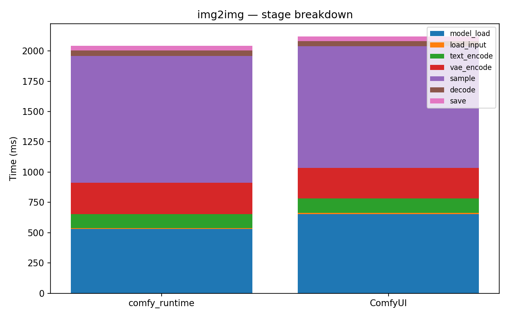

# img2img

[← Back to summary](../README.md)

## Stage breakdown (mean +/- stddev, ms)

| Stage | comfy_runtime min | mean | median | stddev | ComfyUI min | mean | median | stddev | Δmean |
|---|---|---|---|---|---|---|---|---|---|
| model_load | 527.8 | 531.2 | 532.0 | 2.5 | 646.4 | 654.1 | 653.0 | 6.9 | -18.8% |
| load_input | 7.8 | 7.9 | 7.8 | 0.1 | 8.9 | 9.0 | 9.0 | 0.1 | -12.4% |
| text_encode | 115.0 | 115.7 | 115.6 | 0.6 | 118.9 | 119.1 | 119.1 | 0.1 | -2.8% |
| vae_encode | 255.1 | 256.2 | 255.9 | 1.1 | 250.8 | 253.9 | 254.1 | 2.5 | +0.9% |
| sample | 1034.1 | 1048.1 | 1040.6 | 15.5 | 994.9 | 1002.3 | 998.5 | 8.0 | +4.6% |
| decode | 44.8 | 45.0 | 45.0 | 0.2 | 41.1 | 41.2 | 41.2 | 0.2 | +9.1% |
| save | 38.2 | 38.2 | 38.2 | 0.1 | 38.4 | 38.7 | 38.8 | 0.3 | -1.3% |

| **total** | 2034.3 | 2045.9 | 2036.6 | 14.8 | 2108.7 | 2120.2 | 2108.7 | 16.3 | **-3.5%** |

## Memory

| Metric | comfy_runtime (MB) | ComfyUI (MB) | Δ |
|---|---|---|---|
| GPU max allocated | 6565.6 | 2645.5 | +148.2% |
| GPU max reserved  | 6760.0 | 2908.0 | +132.5% |
| Host VmHWM        | 6959.6 | 7016.1 | -0.8% |

## Per-node breakdown (mean, ms)

| Node | Call index | comfy_runtime | ComfyUI | Δ |
|---|---|---|---|---|
| CheckpointLoaderSimple | 0 | 531.2 | 654.1 | -18.8% |
| LoadImage | 0 | 7.9 | 9.0 | -12.4% |
| VAEEncode | 0 | 256.2 | 253.9 | +0.9% |
| CLIPTextEncode | 0 | 101.5 | 105.6 | -3.9% |
| CLIPTextEncode | 1 | 14.3 | 13.6 | +5.2% |
| KSampler | 0 | 1048.1 | 1002.3 | +4.6% |
| VAEDecode | 0 | 45.0 | 41.2 | +9.1% |
| SaveImage | 0 | 38.2 | 38.7 | -1.3% |

## Raw data

- [img2img_comfyui_0.json](../data/img2img_comfyui_0.json)
- [img2img_comfyui_1.json](../data/img2img_comfyui_1.json)
- [img2img_comfyui_2.json](../data/img2img_comfyui_2.json)
- [img2img_comfyui_3.json](../data/img2img_comfyui_3.json)
- [img2img_runtime_0.json](../data/img2img_runtime_0.json)
- [img2img_runtime_1.json](../data/img2img_runtime_1.json)
- [img2img_runtime_2.json](../data/img2img_runtime_2.json)
- [img2img_runtime_3.json](../data/img2img_runtime_3.json)
