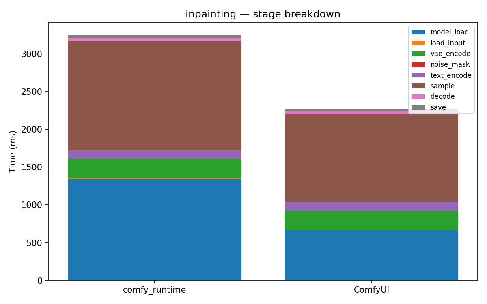

# inpainting

[← Back to summary](../README.md)

## Stage breakdown (mean +/- stddev, ms)

| Stage | comfy_runtime min | mean | median | stddev | ComfyUI min | mean | median | stddev | Δmean |
|---|---|---|---|---|---|---|---|---|---|
| model_load | 1338.2 | 1344.8 | 1345.6 | 5.1 | 655.0 | 662.1 | 658.7 | 7.6 | +103.1% |
| load_input | 7.7 | 8.3 | 7.9 | 0.8 | 8.7 | 8.9 | 8.9 | 0.2 | -6.8% |
| vae_encode | 253.3 | 256.4 | 257.4 | 2.2 | 250.7 | 252.1 | 251.5 | 1.5 | +1.7% |
| noise_mask | 0.0 | 0.0 | 0.0 | 0.0 | 0.1 | 0.1 | 0.1 | 0.0 | -43.7% |
| text_encode | 113.3 | 114.5 | 114.7 | 0.9 | 116.7 | 117.8 | 118.3 | 0.8 | -2.8% |
| sample | 1418.2 | 1449.1 | 1460.8 | 22.1 | 1133.3 | 1159.1 | 1170.5 | 18.3 | +25.0% |
| decode | 43.4 | 43.4 | 43.4 | 0.0 | 40.7 | 40.8 | 40.8 | 0.1 | +6.3% |
| save | 33.3 | 34.6 | 35.1 | 0.9 | 35.0 | 35.6 | 35.3 | 0.6 | -2.6% |

| **total** | 3359.4 | 3393.1 | 3399.0 | 25.4 | 2251.3 | 2278.5 | 2279.8 | 21.6 | **+48.9%** |

## Memory

| Metric | comfy_runtime (MB) | ComfyUI (MB) | Δ |
|---|---|---|---|
| GPU max allocated | 6565.6 | 2645.5 | +148.2% |
| GPU max reserved  | 6760.0 | 2908.0 | +132.5% |
| Host VmHWM        | 6916.8 | 7016.0 | -1.4% |

## Per-node breakdown (mean, ms)

| Node | Call index | comfy_runtime | ComfyUI | Δ |
|---|---|---|---|---|
| CheckpointLoaderSimple | 0 | 1344.8 | 662.1 | +103.1% |
| LoadImage | 0 | 8.3 | 8.9 | -6.8% |
| VAEEncode | 0 | 256.4 | 252.1 | +1.7% |
| SetLatentNoiseMask | 0 | 0.0 | 0.1 | -43.7% |
| CLIPTextEncode | 0 | 100.4 | 104.4 | -3.8% |
| CLIPTextEncode | 1 | 14.1 | 13.4 | +5.3% |
| KSampler | 0 | 1449.1 | 1159.1 | +25.0% |
| VAEDecode | 0 | 43.4 | 40.8 | +6.3% |
| SaveImage | 0 | 34.6 | 35.6 | -2.6% |

## Raw data

- [inpainting_comfyui_0.json](../data/inpainting_comfyui_0.json)
- [inpainting_comfyui_1.json](../data/inpainting_comfyui_1.json)
- [inpainting_comfyui_2.json](../data/inpainting_comfyui_2.json)
- [inpainting_comfyui_3.json](../data/inpainting_comfyui_3.json)
- [inpainting_runtime_0.json](../data/inpainting_runtime_0.json)
- [inpainting_runtime_1.json](../data/inpainting_runtime_1.json)
- [inpainting_runtime_2.json](../data/inpainting_runtime_2.json)
- [inpainting_runtime_3.json](../data/inpainting_runtime_3.json)
