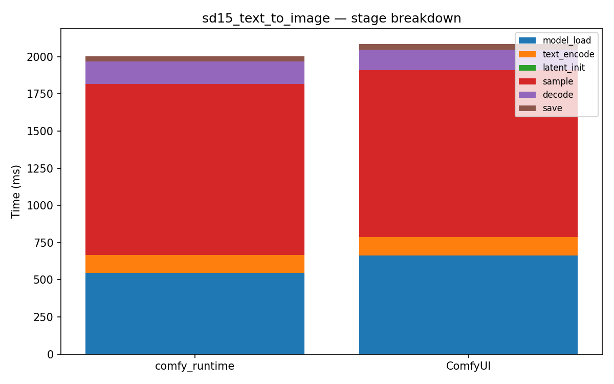

# sd15_text_to_image

[← Back to summary](../README.md)

## Stage breakdown (mean +/- stddev, ms)

| Stage | comfy_runtime min | mean | median | stddev | ComfyUI min | mean | median | stddev | Δmean |
|---|---|---|---|---|---|---|---|---|---|
| model_load | 542.5 | 545.0 | 544.0 | 2.5 | 658.4 | 664.2 | 661.9 | 6.0 | -18.0% |
| text_encode | 121.7 | 122.8 | 123.0 | 0.8 | 121.2 | 122.9 | 123.4 | 1.2 | -0.1% |
| latent_init | 0.1 | 0.1 | 0.1 | 0.0 | 0.2 | 0.2 | 0.2 | 0.0 | -71.5% |
| sample | 1134.6 | 1150.4 | 1149.1 | 13.5 | 1109.4 | 1120.8 | 1114.8 | 12.5 | +2.6% |
| decode | 144.7 | 149.9 | 145.0 | 7.2 | 137.6 | 139.9 | 140.9 | 1.7 | +7.1% |
| save | 35.5 | 35.7 | 35.6 | 0.2 | 36.1 | 36.4 | 36.4 | 0.3 | -2.1% |

| **total** | 1984.6 | 2007.4 | 2000.8 | 21.8 | 2073.1 | 2085.8 | 2081.8 | 12.2 | **-3.8%** |

## Memory

| Metric | comfy_runtime (MB) | ComfyUI (MB) | Δ |
|---|---|---|---|
| GPU max allocated | 5007.0 | 2639.5 | +89.7% |
| GPU max reserved  | 5202.0 | 2896.0 | +79.6% |
| Host VmHWM        | 6959.3 | 7016.4 | -0.8% |

## Per-node breakdown (mean, ms)

| Node | Call index | comfy_runtime | ComfyUI | Δ |
|---|---|---|---|---|
| CheckpointLoaderSimple | 0 | 545.0 | 664.2 | -18.0% |
| CLIPTextEncode | 0 | 109.1 | 109.0 | +0.1% |
| CLIPTextEncode | 1 | 13.7 | 13.9 | -1.3% |
| EmptyLatentImage | 0 | 0.1 | 0.2 | -71.5% |
| KSampler | 0 | 1150.4 | 1120.8 | +2.6% |
| VAEDecode | 0 | 149.9 | 139.9 | +7.1% |
| SaveImage | 0 | 35.7 | 36.4 | -2.1% |

## Raw data

- [sd15_text_to_image_comfyui_0.json](../data/sd15_text_to_image_comfyui_0.json)
- [sd15_text_to_image_comfyui_1.json](../data/sd15_text_to_image_comfyui_1.json)
- [sd15_text_to_image_comfyui_2.json](../data/sd15_text_to_image_comfyui_2.json)
- [sd15_text_to_image_comfyui_3.json](../data/sd15_text_to_image_comfyui_3.json)
- [sd15_text_to_image_runtime_0.json](../data/sd15_text_to_image_runtime_0.json)
- [sd15_text_to_image_runtime_1.json](../data/sd15_text_to_image_runtime_1.json)
- [sd15_text_to_image_runtime_2.json](../data/sd15_text_to_image_runtime_2.json)
- [sd15_text_to_image_runtime_3.json](../data/sd15_text_to_image_runtime_3.json)
